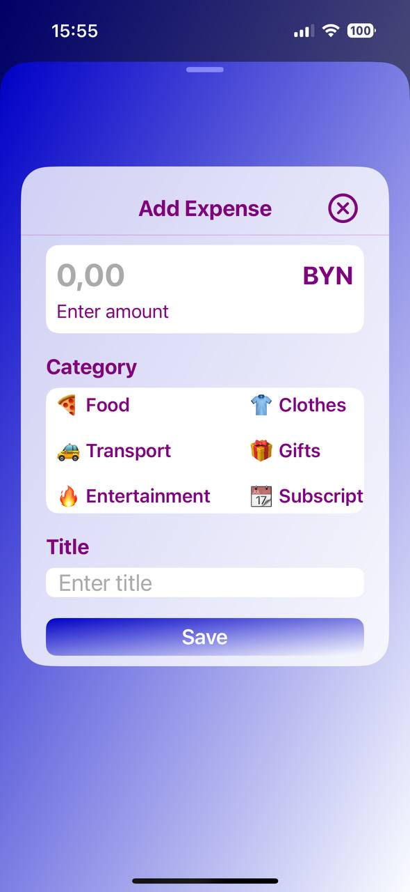
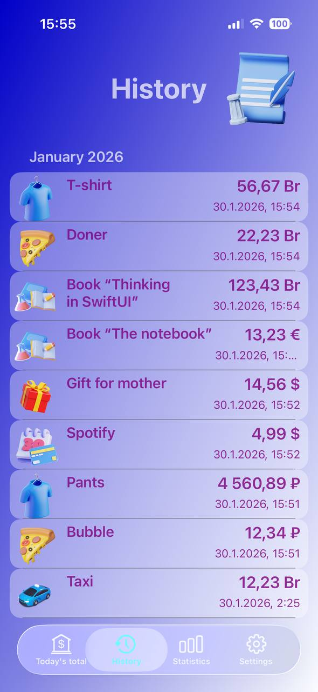
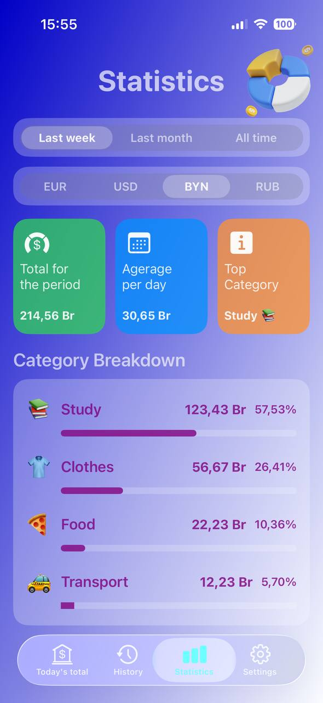
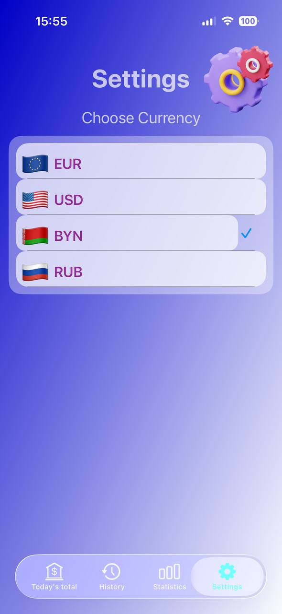

# 💸 DailySpend — Expense Tracker (UIKit)

An iOS application for tracking daily expenses with statistics and multi-currency support.  
Built with **UIKit** using native iOS technologies.

> This is a pet project created to practice UIKit, app architecture, and UI design.

---

## 📱 Screenshots

| Today | Add Expense | History | Statistics | Settings |
|------|------------|--------|-----------|----------|
|  |  |  |  |  |

---

## ✨ Features

- 📊 Expense statistics (daily / weekly / monthly)
- 🧾 Full expense history
- 🗂 Expense categories (Food, Transport, Clothes, etc.)
- 💱 Multi-currency support (EUR, USD, BYN, RUB)
- 🎨 Custom UI with gradients and icons
- 💾 Local data storage using UserDefaults

---

## 🛠 Tech Stack

- Swift
- UIKit
- Auto Layout
- MVC
- UserDefaults


## 🚀 Getting Started

1. Clone the repository:
```bash
git clone https://github.com/suni22/DailySpend.git
```
2. Open y .xcodeproj in Xcode
3. Run the app on a simulator or real device (iOS 15+)
